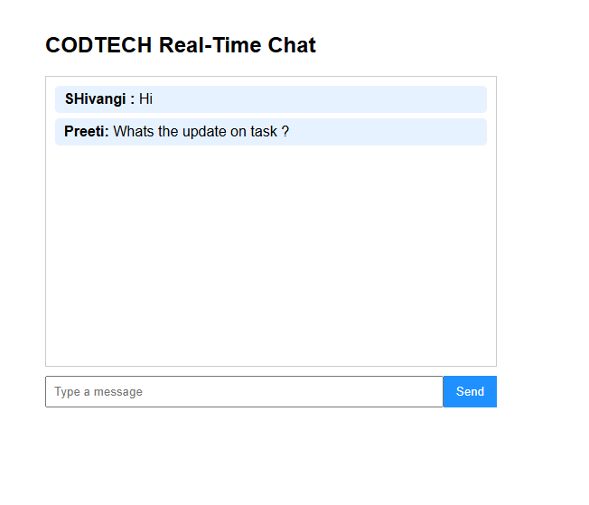
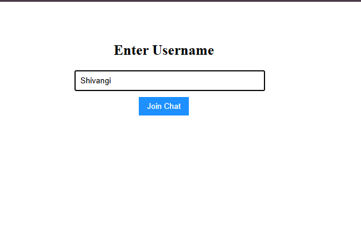

# Codetech-Internship-Task2

## Real-Time Chat Application

**Name:** Shivangi Girjesh Pandey

**Company:** CODTECH IT SOLUTIONS PVT. LTD

**ID:** CT04DR2703

**Domain:** Frontend Web Development

**Duration:** Dec 04th 2025 to Jan 04th 2026

---

## 📌 Project Overview

This project is a **Real-Time Chat Application** developed as **Task 2** of the CODTECH Internship.
It enables multiple users to communicate instantly using **WebSockets**, ensuring real-time message exchange without page refresh.

---

## 🛠️ Technologies Used

* React.js
* Node.js
* Express.js
* Socket.IO
* CSS

---

## ✨ Features

* Real-time messaging using WebSockets
* Responsive chat interface
* Live message updates without refreshing
* Message history maintained during the active session

---

## ❌ Features Not Implemented (As Per Task Scope)

* Username authentication
* Chat rooms
* Database persistence

*(These were intentionally excluded as they were not required in the task description.)*

---

## 📂 Project Structure

```
Task2/
├── client/        # React frontend
├── server/        # Backend with Socket.IO
├── screenshots/   # Screenshots of the application
└── README.md
```

---

## ⚙️ How to Run the Project

### Step 1: Run Backend

```bash
cd server
npm install
node index.js
```

### Step 2: Run Frontend

```bash
cd client
npm install
npm start
```

The application runs on **[http://localhost:3000](http://localhost:3000)**

---

## 📸 Screenshots

### Chat Interface


### Live Messaging


---

## ✅ Outcome

This task helped in understanding:

* Real-time client-server communication
* WebSocket implementation using Socket.IO
* State handling in React for live applications

---

## 📌 Deliverable

A **responsive real-time chat application** with instant messaging and session-based message history.
